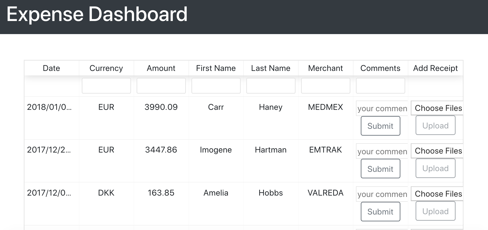

# Expense Dashboard

## About this project

This is an expense dashboard that simulates how user interface could look like when users log into an online portal to check their credit card usage. Through this platform, users can add comments on a listed expense, execute filter search, as well as add receipt image(s) when needed.

This project uses the data provided and developed by [pleo]

## Demo 


## Challenges in Implementation

The part that was the hardest to implement was the upload files. There was a couple bugs in the api server file. ( line 78 in expenses.ts && line 70 remove the 's' from receipt) Thus the form data was not passing the way it should and it took longer than it should to implement that part.

## What functionalities are you most proud of?

There are several options in creating the table. At the end I have chosen React-table for its scalability and responsive nature. I am most proud of implementing state management using Redux.

## Current Functionalities

- User can list expenses
- User can add a comment on an expense
- User can filter on expenses (client side filters)
- User can add a receipt image on an expense

## Future Development

The design of the web page is yet to be polished. And the next step I will be focusing on making it visually appealing.

## Technical Overview

This project was bootstrapped with [Create React App](https://github.com/facebook/create-react-app).

## Getting Started 
### There is another API Server set up that feeds data to frontend 
To run that API server locally, navigate to api-server folder then 

```cd api-server```
```npm install```
```npm start```

API is now running at 'http://localhost:3000'
### Available Scripts

In the project directory, you can run:

#### `npm start`

```cd frontend```
Runs the app in the development mode.<br>
Open [http://localhost:3000](http://localhost:3000) to view it in the browser.


#### `npm test`

Launches the test runner in the interactive watch mode.<br>
See the section about [running tests](https://facebook.github.io/create-react-app/docs/running-tests) for more information.

#### `npm run build`

Builds the app for production to the `build` folder.<br>
It correctly bundles React in production mode and optimizes the build for the best performance.

The build is minified and the filenames include the hashes.<br>
Your app is ready to be deployed!

See the section about [deployment](https://facebook.github.io/create-react-app/docs/deployment) for more information.

#### `npm run eject`

**Note: this is a one-way operation. Once you `eject`, you can’t go back!**

If you aren’t satisfied with the build tool and configuration choices, you can `eject` at any time. This command will remove the single build dependency from your project.

Instead, it will copy all the configuration files and the transitive dependencies (Webpack, Babel, ESLint, etc) right into your project so you have full control over them. All of the commands except `eject` will still work, but they will point to the copied scripts so you can tweak them. At this point you’re on your own.

You don’t have to ever use `eject`. The curated feature set is suitable for small and middle deployments, and you shouldn’t feel obligated to use this feature. However we understand that this tool wouldn’t be useful if you couldn’t customize it when you are ready for it.

### Learn More

You can learn more in the [Create React App documentation](https://facebook.github.io/create-react-app/docs/getting-started).

To learn React, check out the [React documentation](https://reactjs.org/).

#### Code Splitting

This section has moved here: https://facebook.github.io/create-react-app/docs/code-splitting

### Analyzing the Bundle Size

This section has moved here: https://facebook.github.io/create-react-app/docs/analyzing-the-bundle-size

### Making a Progressive Web App

This section has moved here: https://facebook.github.io/create-react-app/docs/making-a-progressive-web-app

### Advanced Configuration

This section has moved here: https://facebook.github.io/create-react-app/docs/advanced-configuration

### Deployment

This section has moved here: https://facebook.github.io/create-react-app/docs/deployment

### `npm run build` fails to minify

This section has moved here: https://facebook.github.io/create-react-app/docs/troubleshooting#npm-run-build-fails-to-minify

[pleo]: https://www.pleo.io/de/

## The set up of the database aims to supplement the feature of submitting comments and uploading receipts from users' input. 


## There is another API Server set up that feeds data to frontend 
To run that API server locally, navigate to api-server folder then 

```cd api-server```
```npm install```
```npm start```

API is now running at 'http://localhost:3000'


